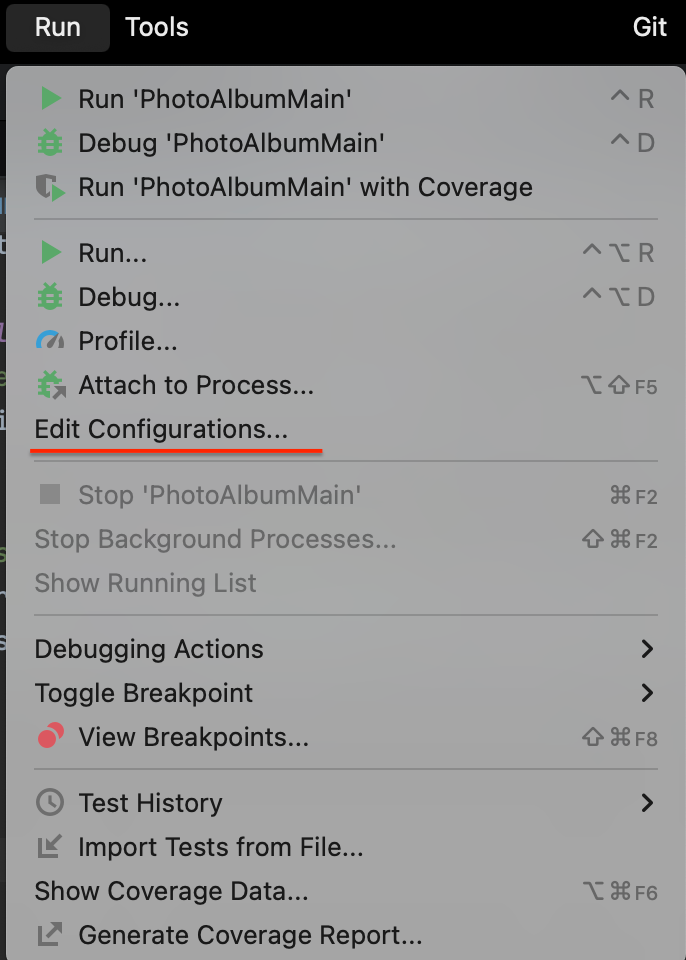
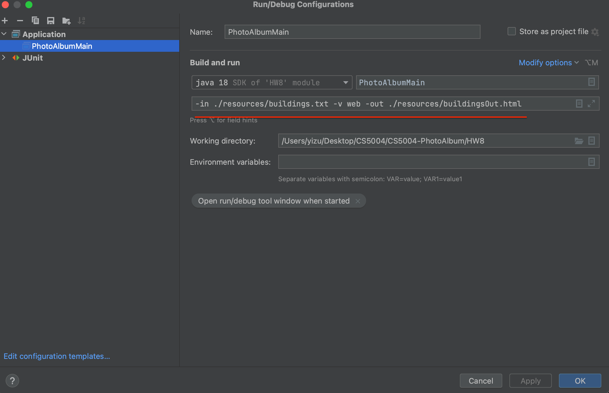

# Design

The main of my design is to use a canvas to represent the moment in time before taking a snapshot.
The analogy is when you take a screenshot on your computer, that represents the canvas,
once you save the screenshot, then a new snapshot is created, that new snapshot is created and stored in the album.

# Technical Decisions and Reasons

## Canvas layer
- Abstract the manipulation of shapes on this layer to avoid bloating Album level to do manipulations

## Interfaces for shapes and canvas
- Provide a blueprint for concrete classes 
- Extensibility for future extensions
- Following Open-closed Principle (OCP):
  - Objects or entities should be open for extension but closed for modification.

## Abstract shape
- Avoid repetition of code
- Shape concrete classes are clean and easy to read

## `id` variable for shape 
- Assumed `name` variable can be duplicate
- Unique identifier to check same shapes with same properties, but different `id`

## `createSnapshot` adds to `snapshotList`
- Did not separate the creation and addition to the list of snapshots as snapshots will always 
have unique ids due to the timestamps at the moment of creation

# HW 9 

## How to run
1. Go to `Edit Configurations...`

2. To run web view
3. Type in highlighted in red section
  - `-in ./resources/buildings.txt -v web -out ./resources/buildingsOut.html`
4. Click `Apply` button on bottom right
5. Click `OK` button on bottom right

1. To run graphical view type in highlighted in red section 
  - `-in ./resources/buildings.txt -v graphical 1000 1000`
2. Repeat steps `4` and `5`

## Design Change from HW8

- HTML addition of `name` attribute
  - Using name for backend purposes as a best practice to send data to server
  `https://www.w3docs.com/snippets/html/what-is-the-difference-between-the-id-and-name-attributes.html`

## Additions

- Creation of `canvas` in `Album` constructor
  - Reason: Creating an `Album` means creating a `canvas` as well 
    - commit `85c66e9`
- Get the list of snapshot `id` via `getSnapshotIds` method for dropdown
  - Reason: For dropdown in `GraphicalView`

## Bug fixes

- Missed addition to `shapeList` in canvas after creation
  - commit `ed9eb86`

- Missed deep copy of shapes to pass in canvas as `shapeList` when doing a new snapshot in canvas after creation
  - commit `47485a6`

## Sources
[MVC Lecture Code Samples](https://github.khoury.northeastern.edu/kbagley/fall-2022-cs5004/tree/main/MVC_Lectures/src)

## Thank you for your time!